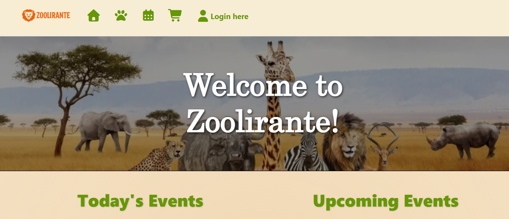
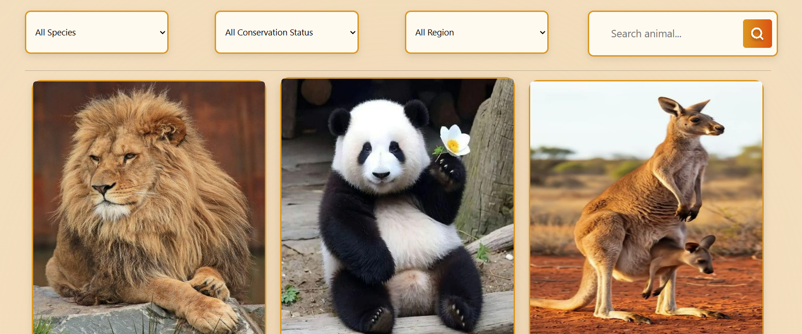
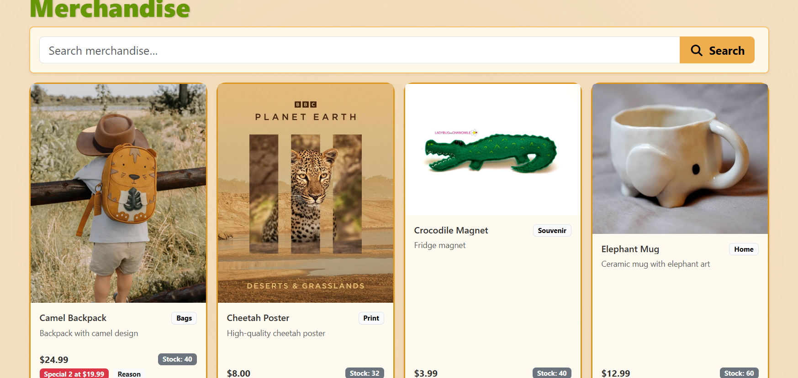
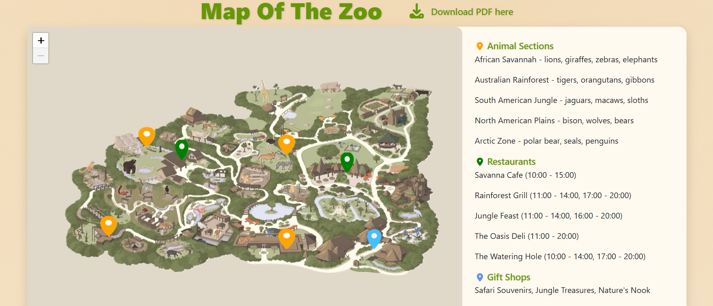
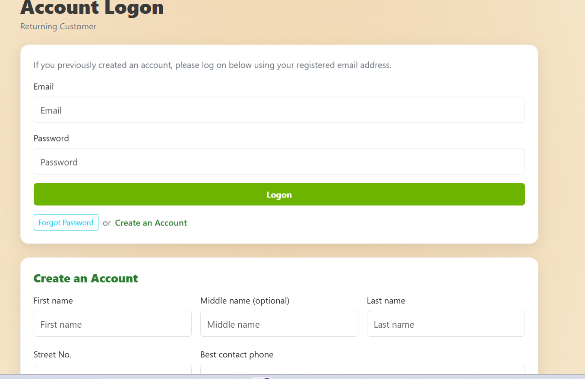

# Zoolirante_Open_Minded
---
## Project Summary
- The web application is designed to enhance visitor engagement and streamline zoo operations for Zoolirante’s new Australian zoo. 

- Key features include an animal showcase with detailed information and an interactive zoo map for easy navigation, an event listing system where visitors can view upcoming events and staff can create or manage events linked to one or more animals, and a ticket reservation system with secure online payments. The application also includes a zoo merchandise store for browsing and pre-purchasing items for pickup on the day, as well as user account management, enabling users to create accounts, save payment methods, track visit and purchase history, follow favourite animals, and optionally become zoo members to receive monthly benefits.

- Some images of the web: 

	
   
Figure 1. Home page of Zoolirante Web

	
   
Figure 2. Animals list page

	
   
Figure 3. Zoo Merchandise

	
   
Figure 4. Zoolirante Map 

	
   
Figure1. Login Page

## Features
- Animal Showcase: Displays detailed information about zoo animals.

- Event Management: Allows visitors to view upcoming zoo events, while enabling staff to create, update, and manage events linked to one or more animals.

- Ticket Reservation: Provides a secure online payment system for purchasing zoo entry tickets directly through the application.

- Zoo Merchandise Store: Enables users to browse and pre-purchase zoo merchandise, such as plush toys and books, for collection on the day of their visit.

- User Account Management: Allows users to create accounts, save payment methods, track visit and purchase history, follow favourite animals, and optionally subscribe to a zoo membership for monthly benefits.

## Technologies Used
### I. Frontend
- HTML
- CSS
- Boostrap
- JavaScript

###	II. Backend
- ASP.NET / ASP.NET Core (C#): Provide CRUD (Create, Read, Update, Delete) operations for animals, events, merchandise, and user accounts

### III. Database
- SQL Server

## How to run Project 
### 1. Clone the repository

`https://github.com/nhandang1304/Zoolirante_WebApp.git`

### 2. Open the project in Visual Studio

### 3. Database Setup Instructions
- There is a document named [DATABASE CONNECTION.docx](DATABASE%20CONNECTION.docx), which is instruction how to import database of this project
- From menu, select <b>View ? Server Explorer</b>, then click <b>Data Connections -> Add Connection -> Enter your server name then choose the database </b>

### 4. Run the application using IIS Express or dotnet run
